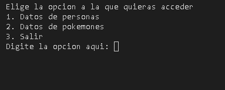
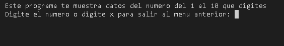
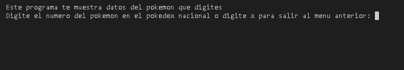
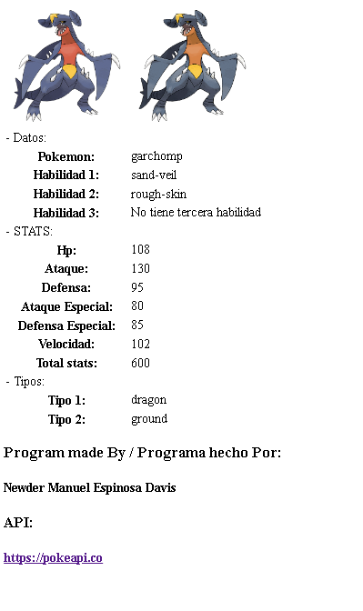

# Datos_personas_y_pokemones
Este es un programa hecho en python el cual te muestra un menu en el que podras elegir si quiere saber datos aleatorios sobre 10 personas o saber informacion acerca de un pokemon segun su numero de pokedex nacional, este programa utiliza APIs, tales como: "jsonplaceholder.typicode.com" para obtener los datos sobre las personas y "pokeapi.co" para obtener los datos sobre los pokemones

Menu Principal:

Datos de Pesonas:

Datos de Pokemones:

